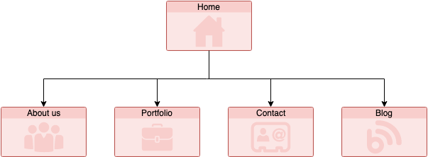
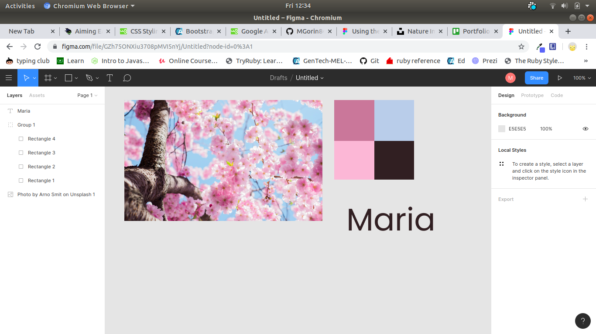
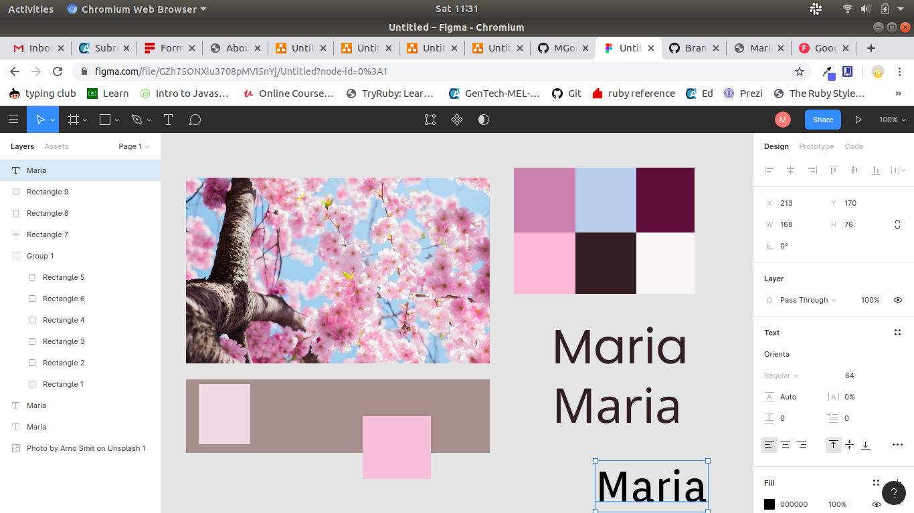
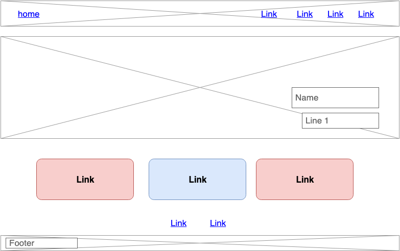
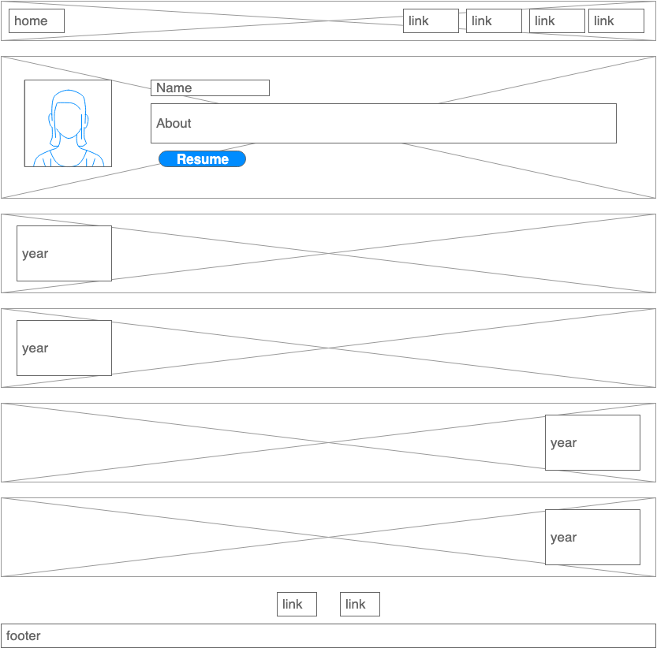

# Maria Gorin

My name is Maria and this is my first HTML/CSS project - My Portfolio.

This is a link to my website.. 

This is a link to my my GitHub repository..

### Purpose

I created this Website as an assignment for my ongoing study to become a web developer. All the code related to this website was written by me based on my design.

The main purpose of this project was to create a personal portfolio site to demonstrate my HTML/CSS skills and abilities and to tell a little bit about myself and my future goals.

### Functionaliti/Features:

My portfolio contains 5 pages:
- Home
- About me
- Portfolio
- Blog
- Contact for

Here is sitemap

All of those pages are equipped with a navigation bar on top of the content.

All of the pages also contain links to my professional social media accounts GitHub and LInkedIn

"About me" page has a quick introduction and a timeline. There is also a link to my resume (which is a mock-up resume at this point)

"Blog" page has 5 blog items with images. I used flex-box for this page and made it responsive to mobile-view by changing flex-direction. Each item is set a maximum height and has a scroll bar to fit larger content without changing the look of the page. 

"Portfolio" page is made to show my current and future projects. I used grid to organize content of the page and made it responsive by changing the widths of the columns in a mobile view.

"Contact me" form is mainly a contact form linked to my e-mail through Formspree.

### Design

In a choice of colors I was inspired by a picture of Cherry blossom (Photo by Arno Smit on Unsplash) which reminded me of my childhood in the east of Russia at the Japanese sea.

I used Figma to pick the colors and fonts for my project.
These are a couple of screenshots I took in a progress

These are a couple of wireframes I drew for the project.

